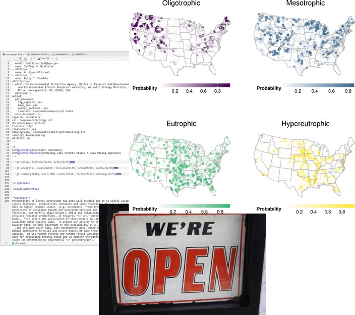

```{r setup, include=FALSE}
knitr::opts_chunk$set(echo = FALSE)
```

## Who am I?

:::::::::::::: {.columns}
::: {.column}
- Landscape ecology/GIS/Lakes/Data Science 
- US EPA Research Ecologist since ~2006
- Worked on: Forests, wetlands, gopher tortoise, estuaries, lakes, cyanobacteria, ...
- useR since 2000 (yikes!)
:::

::: {.column}

:::
::::::::::::::

## What is R?

:::::::::::::: {.columns}
::: {.column}
- "Free software environment for statistical computing and graphics"
- Dialect of the S language
- Written by Ross Ihaka and Robert Gentleman
- First Release in 1993, version 1.0 in 2000
- Current version 4.0.4 (aka "Lost Library Book") released Feb 2021.
- Fully functional, general purpose programming language
- Excels at statistics and visualization
- Why is it called "R"?
:::

::: {.column}


:::
::::::::::::::

## Why use R?

:::::::::::::: {.columns}
::: {.column}

- Free!
- Statistics and Graphics
- GIS/Spatial
- Writing Papers
- Presentations (like this one)
- Develop new tools
- Reproducibility
- Open Science
  
:::

::: {.column}



:::
::::::::::::::

## R vs. Python 


## R ~~vs.~~ & Python 


## R and EPA

- R Users Group
- Installations

## Base R

## Extending Base R: Packages

## What can you do with R?

## Statistics

## Geospatial/GIS

## Documents

## Web applications

## Learn More

- #rstats

