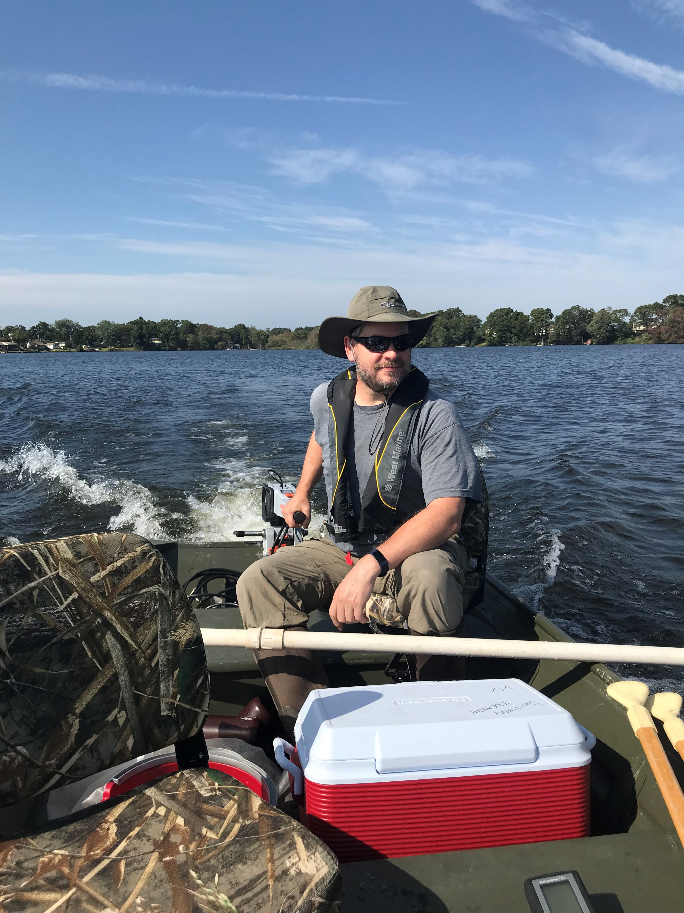
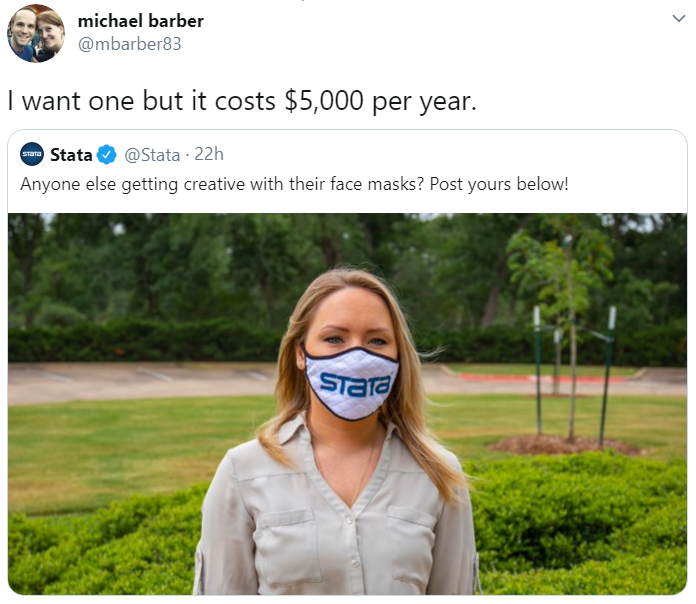
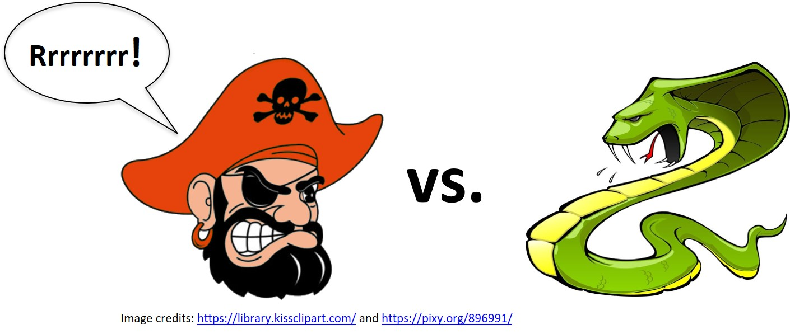
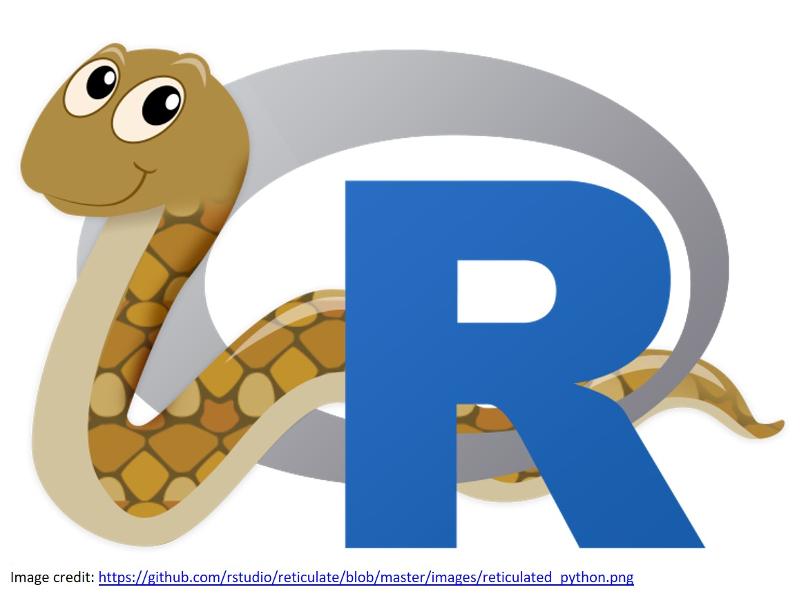
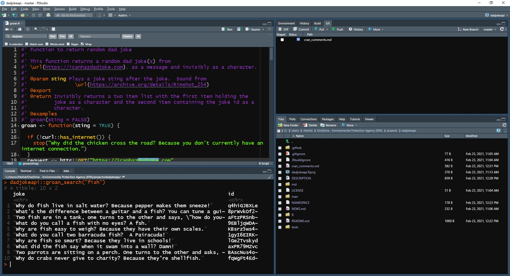

```{r setup, include=FALSE}
knitr::opts_chunk$set(echo = FALSE)
```

## Who am I?

:::::::::::::: {.columns}
::: {.column}
- Landscape ecology/GIS/Lakes/Data Science 
- US EPA Research Ecologist since ~2006
- Worked on: Forests, wetlands, gopher tortoise, estuaries, lakes, cyanobacteria, ...
- useR since 2000 (yikes!)
:::

::: {.column}

:::
::::::::::::::

## What is R?

:::::::::::::: {.columns}
::: {.column}
- "Free software environment for statistical computing and graphics"
- Dialect of the S language
- Written by Ross Ihaka and Robert Gentleman
- First Release in 1993, version 1.0 in 2000
- Current version 4.0.4 (aka "Lost Library Book") released Feb 2021.
- Fully functional, general purpose programming language
- Excels at statistics and visualization
- Why is it called "R"?
:::

::: {.column}


:::
::::::::::::::

## Why use R?

:::::::::::::: {.columns}
::: {.column}

- Free!
- Statistics and Graphics
- GIS/Spatial
- Writing Papers
- Presentations (like this one)
- Develop new tools
- Reproducibility
- Open Science
  
:::

::: {.column}



:::
::::::::::::::

## R vs. Python 


## R ~~vs.~~ & Python 



## R and EPA
:::::::::::::: {.columns}
::: {.column}
- Large and active community
- January 2019 ~900 installations at EPA (HQ offices only)
- [R Users Group](https://teams.microsoft.com/l/channel/19%3aa6272ef8a55c404ea56fa19145076a3d%40thread.skype/R%2520User%2520Group?groupId=93022b12-6005-468e-a542-501d13b4caa8&tenantId=88b378b3-6748-4867-acf9-76aacbeca6a7)
  - Teams channel in the Data Science team
  - Sharepoint (legacy)
  - Monthly meetings
- Installation (for HQ Offices, regions are Ad hoc)
  - R
  - RStudio
  - Rtools (required build tools for Windows)
::: {.column}
::: {.column}


:::
::::::::::::::
## RStudio

:::::::::::::: {.columns}
::: {.column}

- Integrated Development Environment
- Also a company that supports the R community
- RStudio 1-minute Demo

::: {.column}



:::
::::::::::::::

## Base R

```{r echo = FALSE}
base_packages <- rownames(installed.packages(priority="base"))
#c("compiler", "graphics", "tools", "utils", "grDevices", "stats", datasets", 
#"methods", "base")
names(base_packages) <- base_packages
base_functions <- lapply(base_packages, function (pkg) getNamespace(pkg))
num_functions <- sum(unlist(lapply(base_functions, length)))
```

- Fresh out of the box you get `r num_functions` functions!
- You can do a lot
  - stats, graphics, parallel computing, ...
- Base R 1-minute Demo

*Need some sort of image*

## Extending Base R: Packages

```{r, echo = FALSE}
bioc_p <- length(BiocManager::available())
```
- Community developed extensions
- Many quality checks
- Two main sources
  - CRAN (https://cran.r-project.org/): `r dim(available.packages())[1]` packages
  - Bioconductor (https://www.bioconductor.org/): `r bioc_p` packages
    - Genomics/bioinformatics

*Need some sort of image*

## What can you do with R?

- Well-known: 
  - Statistics
  - Graphics
- Less well-known:
  - Geospatial/GIS
  - Documents (e.g. word, pdf, ppt)
  - Web applications
- Off-beat things

*Need some sort of image*

## Offbeat things you can do with R

:::::::::::::: {.columns}
::: {.column}
- [beepr](https://cran.r-project.org/package=beepr): Easily Play Notification Sounds on any Platform
- [BRRR](https://github.com/brooke-watson/BRRR): Rap adlibs in R
- [dadjokeapi](https://github.com/jhollist/dadjokeapi): Return a Dad Joke
- [demotivr](https://github.com/joranE/demotivr): Show Demotivational Messages on Errors
- [kittyR](https://cran.r-project.org/package=kittyR): Kitty pictures and meows from R console
- [praise](https://cran.r-project.org/package=praise): Praise Users
- [memer](https://github.com/sctyner/memer): A tidyverse compatible package for creating memes in R using magick
- [rainbowwrite](https://github.com/richfitz/rainbowrite): Rainbow Coloured Output
- [wesanderson](https://cran.r-project.org/package=wesanderson): A Wes Anderson Palette Generator
:::
::: {.column}
```{r eval=FALSE}
# Noises!
beepr::beep(2)
BRRR::skrrrahh()
kittyR::meowR(4)
BRRR::skrrrahh(16)

# Messages
dadjokeapi::groan()
praise::praise()
demotivr::nothing_matters()

# Images and colors
library(magrittr)
meme_get("DosEquisMan") %>% 
 meme_text_top("I don't always useR!", size = 28) %>% 
 meme_text_bottom("But when I do, I procrastinate\nby making memes.", size = 28)
joke <- dadjokeapi::groan(FALSE)$joke
rainbowrite::lolcat(joke)
```
:::
::::::::::::::

## Statistics 1 minute demo

```{r, eval=FALSE}
library(readr)
nla_wq <- read_csv("https://www.epa.gov/sites/production/files/2014-10/nla2007_chemical_conditionestimates_20091123.csv") 
nla_wq <- nla_wq[complete.cases(nla_wq[,c("CHLA", "PTL", "NTL")]),]
mean(nla_wq$CHLA)
t.test(nla_wq$CHLA ~ nla_wq$LAKE_ORIGIN)
nla_lm <- lm(log10(CHLA) ~ log10(PTL) + log10(NTL), data = nla_wq)
summary(nla_lm)
```

## Visualization 1 minute demo

```{r, eval=FALSE}
library(ggplot2)
nla_wq %>%
  ggplot(aes(x=NTL,y=PTL)) +
  geom_point(aes(size=CHLA, color=CHLA)) +
  scale_x_log10() +
  scale_y_log10() +
  scale_color_continuous(low = "springgreen", high = "darkgreen") +
  geom_smooth(method = "lm", color = "grey50") +
  theme_classic() +
  labs(title = "Total Nitrogen, Total Phosphorus, and Chlorophyll Associations",
       x = "Log 10 (Total Nitrogen)",
       y = "Log 10 (Total Phosphorus)")
```

## Geospatial 1 minute demo

```{r, eval=FALSE}
library(USAboundaries); library(sf); library(dplyr); 
library(elevatr); library(mapview); library(raster)

# Get map of lower 48 states
usa_l48 <- us_boundaries() %>%
  filter(state_abbr != "HI" & 
           state_abbr != "AK" &
           state_abbr != "PR") 
# Get DEM.  Zoom level 4 returns dem of ~ 3.8km resolution for whole of lower 48
usa_l48_dem <- get_elev_raster(as(usa_l48, "Spatial"), src="aws", z = 4, clip = "location")

mapview(usa_l48_dem) + usa_l48
```

## Documents 1 minute demo

- R mixed with Markdown: https://daringfireball.net/projects/markdown/
- PDF
- Word Documents
- Presentations

## Web 1 minute demo

- Shiny
- Shiny examples: https://shiny.rstudio.com/gallery/
- Shiny at EPA
  - https://shiny.epa.gov/fcedts/ 
  - Internal at NCC
  - Working on other options
- Web and HTML tools galore
  - Visualization
  - Web Scraping
  - APIs

## Learn More

- Twitter
  - #rstats
  - #TidyTuesday
  - #rspatial
- EPA R User Group
  - Monthly Meetings
  - Face to face meeting every 2 years
    - September, but we'll see...
- learnr: https://rstudio.github.io/learnr/
- The Carpentries: https://carpentries.org/

*need images*

## Questions

